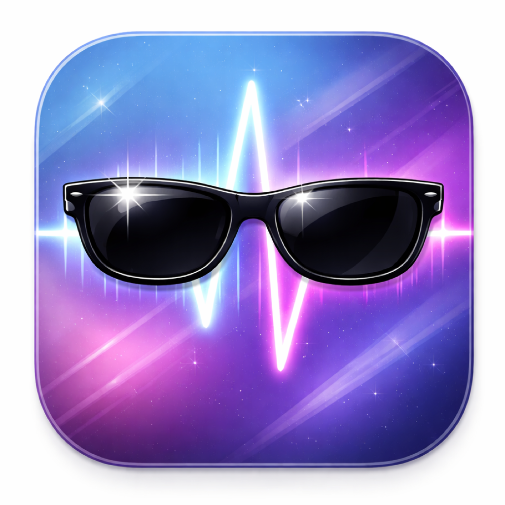
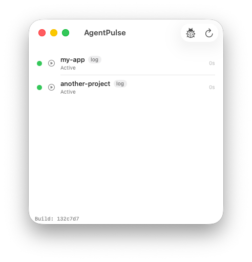

# AgentPulse

<p align="center">
  
</p>

<p align="center">
  <strong>Know when your AI agents need you.</strong>
</p>

<p align="center">
  A native macOS app that monitors Claude Code sessions, detects when they need your input, and sends you a notification.
</p>

<p align="center">
  
</p>

---

## The Problem

You're running Claude Code in one terminal tab, working in another. Claude finishes a task and asks you a question — but you don't notice for 10 minutes. Or it needs permission to run a command and sits there waiting. Meanwhile, you're browsing the web thinking it's still working.

**AgentPulse watches your Claude Code sessions and notifies you the moment they need attention.**

## Features

- **Auto-discovers** all running Claude Code sessions by monitoring `~/.claude/sessions/`
- **Push-based state detection** via kqueue file watching — no polling, sub-second response
- **Detects key states**: active, waiting for input, needs permission approval, idle
- **macOS notifications** with configurable sound when a session needs attention
- **Click to focus** — clicks on a session row switch to the correct Ghostty tab
- **Mock mode** for development and testing without running real agent sessions

## Install

### With pixi (recommended)

```bash
pixi global install --git https://github.com/tdejager/AgentPulse.git
```

This builds the app from source, creates a macOS `.app` bundle with a shortcut, and makes AgentPulse available in Spotlight and Launchpad.

> **Note:** You need the Xcode Command Line Tools installed (`xcode-select --install`) for the Swift compiler.

### Manual build

If you don't want a global install:

```bash
git clone https://github.com/tdejager/AgentPulse.git
cd AgentPulse
pixi run bundle          # debug build
# or
pixi run bundle-release  # release build

open build/AgentPulse.app
```

## Usage

Just launch AgentPulse and start Claude Code sessions in your terminal. Sessions appear automatically within a couple of seconds.

| State | Meaning |
|-------|---------|
| **Active** (green) | Agent is working — running tools, generating text |
| **Waiting for input** (orange) | Turn complete or agent asked you a question |
| **Needs approval** (red) | Agent wants to run a tool and needs your permission |
| **Idle** (gray) | No recent activity |

When a session transitions to "waiting" or "needs approval", you'll get a macOS notification. Click the session row to switch to its Ghostty tab.

### Mock mode

For development or demo purposes:

```bash
pixi run run-mock
```

This shows fake sessions that cycle through different states.

## Development

```bash
pixi run build       # swift debug build
pixi run test        # run 26 state analysis tests
pixi run bundle      # build .app bundle
pixi run run         # bundle + launch
pixi run run-mock    # bundle + launch with fake sessions
pixi run clean       # remove build artifacts
```

### Adding support for a new agent

AgentPulse uses an `AgentBackend` protocol. To add support for a new agent (e.g. Codex):

1. Create `Backends/CodexBackend.swift` implementing `AgentBackend`
2. Register it in `AgentPulseApp.swift`
3. Done — UI, notifications, and monitoring work automatically

## Architecture

```
AgentPulseApp (SwiftUI Window)
  |
  +-- SessionStore             Discovers sessions, manages monitors
  |     +-- [AgentBackend]     Protocol — one impl per agent type
  |     |     +-- ClaudeCodeBackend    ~/.claude/ file watching
  |     |     +-- MockReplayBackend    Fake sessions for testing
  |     +-- [SessionMonitor]   One per session, push-based
  |           +-- JSONLTailReader      kqueue file tailing
  |
  +-- NotificationManager      macOS notifications with debouncing
  +-- TerminalFocuser           Ghostty tab switching via AppleScript
```

**State detection** works by tailing Claude Code's JSONL conversation files and analyzing the last few entries:

- `system.turn_duration` or `assistant.stop_reason == "end_turn"` = turn ended, waiting for input
- `assistant.tool_use` with no `tool_result` after 1s = waiting for permission or user response
- `user.tool_result` = tool just ran, agent is processing
- Recent timestamps = active

When a `tool_use` entry appears, a **deferred re-check** is scheduled. If no `tool_result` arrives within the threshold, the state flips to "waiting". This avoids polling while still catching pending approvals.

## Requirements

- macOS 14+ (Sonoma)
- Swift 5.10+
- Ghostty terminal (for click-to-focus tab switching)

## License

MIT
